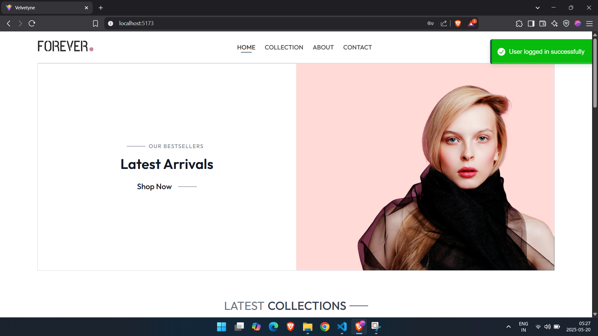
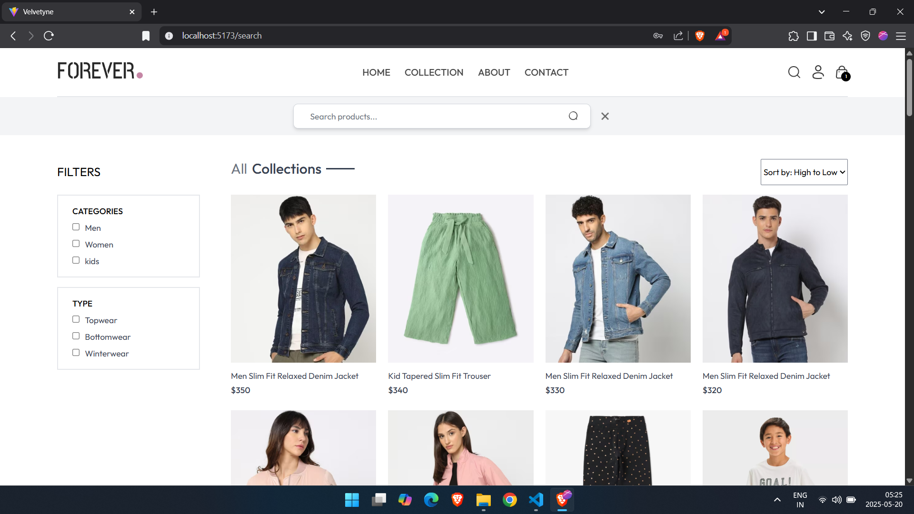
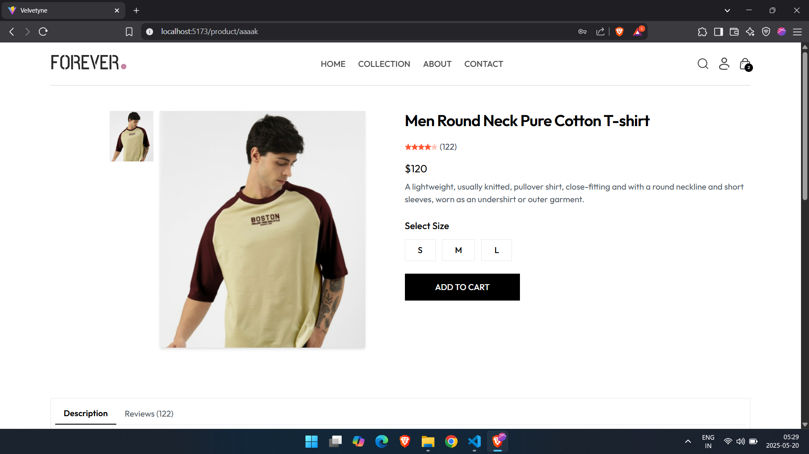

# **Velvetyne**

**Velvetyne** is a full-stack e-commerce platform built with the **MERN stack**. It delivers a modern shopping experience featuring **secure user authentication** and a **role-based admin dashboard**.

---

## **Tech Stack**

**Frontend:**  
React.js, Redux Toolkit, Material UI, React Router

**Backend:**  
Node.js, Express.js, MongoDB, JWT Authentication

**Development Tools:**  
Nodemon, ESLint, Prettier

---

## **Completed Features**

- **Secure Authentication:** OTP login, password reset  
- **User Module:** Wishlist, Orders, Profile management  
- **Product Catalog:** Search, filters, and pagination  
- **Frontend:** All UI pages implemented with Material UI and integrated with Redux Toolkit  

---

## **In Progress**

- Admin Dashboard: CRUD for products, users, orders  
- Cart system: Backend integration with MongoDB  
- Final UI refinement and responsiveness  
- Payment gateway integration (Stripe or Razorpay)  
- Deployment setup on Vercel or AWS  

---

## **Roadmap**

- **Core frontend development** — *completed*  
- **Backend APIs and database modeling** — *completed*  
- **Authentication system (OTP and email)** — *completed*  
- **Admin dashboard CRUD operations** — *pending*  
- **Payment system integration** — *pending*  
- **Deployment to production** — *pending*

---

## **Architecture Overview**

**Frontend:**  
Single Page Application built with **React.js**, utilizing **Redux Toolkit** for state management and **Axios** for API communication.

**Backend:**  
RESTful API developed with **Express.js**, connected to **MongoDB** via **Mongoose**.

**Authentication:**  
JWT-based token authentication combined with OTP via email for enhanced security.

---
## **UI Preview**

### Login with OTP
*Secure authentication flow and success redirect to Homepage*

### Product Listing
*Homepage with product cards, filters, and search*

### Product Details
*Single product view with key information and action buttons*

